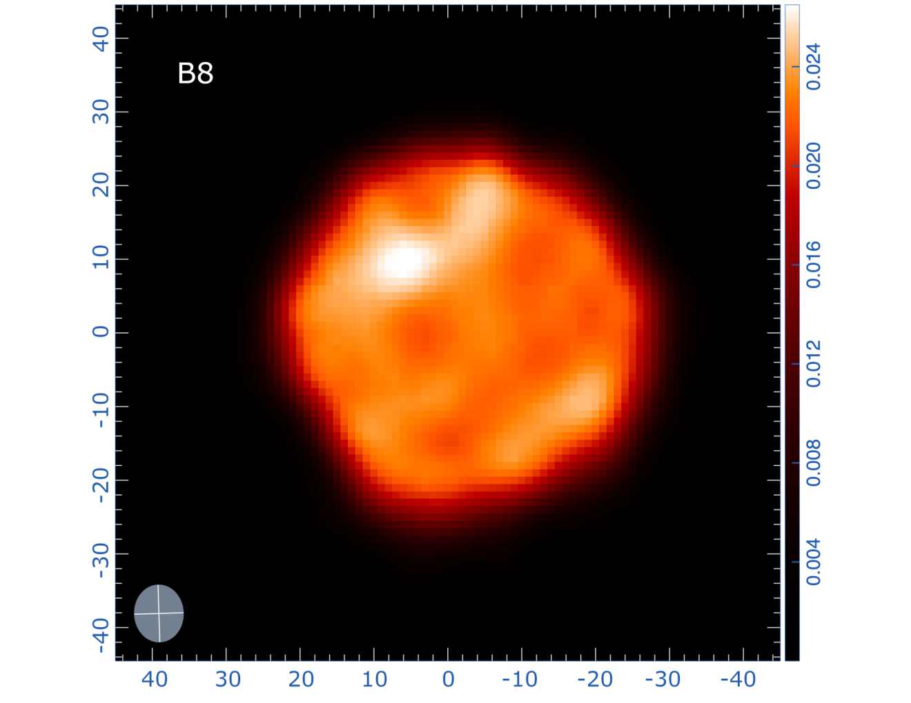

# Betelgeuse Observatory

[](https://github.com/Biswajit1999/betelgeuse-observatory/actions/workflows/web.yml)
[](https://github.com/Biswajit1999/betelgeuse-observatory/actions/workflows/pages.yml)

**Live observatory:** <https://biswajit1999.github.io/betelgeuse-observatory/>

> This project cannot determine whether Betelgeuse has already undergone an event outside Earth's past light cone. It analyses the latest state observable from Earth and evaluates physical models for its subsequent evolution.

**Research author and project lead:** Biswajit Jana

**Scientific verdict (30 August 2026):** no received observation shows core collapse. August 2023 ALMA data resolve a roughly 2300 K, asymmetric sub-millimetre atmosphere with persistent hot structure and evolving molecular gas. A separate 2026 analysis combines VLA/ALMA observations made during 2021-2026 and reports atmospheric perturbations compatible with a close companion. These are observations of a dynamic red supergiant, not an observed supernova ([Dent et al. 2026](https://arxiv.org/abs/2608.19339), [Matthews et al. 2026](https://arxiv.org/abs/2608.02847)).



_ALMA Band 8 editorial preview from Dent et al. (2026), observed 1 August 2023 under programme 2022.A.00026.S. CC BY 4.0. Scientific analysis must use calibrated archive products rather than this rendered figure._

## About Betelgeuse

Betelgeuse, also catalogued as Alpha Orionis (α Ori) and HD 39801, is an
M-type red supergiant marking the reddish shoulder of the constellation
Orion. Its ICRS J2000 position is right ascension
`05 h 55 m 10.30536 s`, declination `+07° 24′ 25.4304″`
([SIMBAD](https://simbad.harvard.edu/simbad/sim-basic?Ident=Betelgeuse&submit=SIMBAD+search)).
The star is bright enough to see without a telescope and is one of the few
stars beyond the Sun whose atmosphere can be spatially resolved.

Its distance is scientifically important and unusually difficult to measure:
surface inhomogeneities move the photocentre, while its brightness complicates
high-precision astrometry. This project adopts the
`172 pc (+13/−11 pc)` estimate used by Dent et al., equivalent to approximately
`561 (+42/−36) light-years`; broader summaries commonly quote roughly
600–700 light-years. The spread is a measurement issue, not evidence that the
star physically changes distance
([Dent et al. 2026](https://arxiv.org/html/2608.19339),
[NASA](https://science.nasa.gov/universe/what-is-betelgeuse-inside-the-strange-volatile-star/)).

Betelgeuse is an unusually valuable laboratory because it combines proximity,
large angular diameter, semiregular pulsation, giant convective structures,
episodic mass loss, molecule and dust formation, and a circumstellar
environment that can be examined from ultraviolet through radio wavelengths.
The 2019–2020 Great Dimming connected surface convection, atmospheric outflow,
cooling, and dust obscuration in a directly observable event. Studying these
processes constrains how red supergiants return chemically enriched material
to the interstellar medium and how massive-star envelopes evolve before a
future core-collapse supernova
([NASA/Hubble](https://science.nasa.gov/missions/hubble/hubble-finds-that-betelgeuses-mysterious-dimming-is-due-to-a-traumatic-outburst/),
[Wheeler & Chatzopoulos 2023](https://academic.oup.com/astrogeo/article/64/3/3.11/7160552)).

The star is also a reminder that “nearby” and “soon” are not the same claim.
The light received now left Betelgeuse centuries ago, while its remaining
lifetime depends on uncertain mass, radius, mixing, pulsation-mode assignment,
rotation, mass loss, and possible binary interaction. Continued monitoring is
therefore scientifically useful even though no received observation presently
shows core collapse.

## Full research report

The complete first-person scientific and engineering write-up is available as [LaTeX source](paper/betelgeuse-observatory-report.tex) and a [compiled PDF](output/pdf/betelgeuse-observatory-report.pdf). It documents the research rationale, equations, data boundaries, contour reconstruction, prediction assumptions, reduced hydrodynamic solver, implementation chronology, tests, limitations, and reproduction commands.

## What is implemented

- An interactive web causality laboratory showing why `t_arrival = t_receive + Delta_t`.
- A two-piece-normal Monte Carlo distance posterior: 172 pc with +13 / -11 pc uncertainty.
- A typed Python science package with tested light-time, angular-size, and continuum calculations.
- Reproduction of the simple three-point ALMA integrated-flux fit, `alpha = 1.49 +/- 0.13`.
- Interactive Band 8 contour, axisymmetric-residual, and matched-beam radial-profile reconstructions following the published figure conventions while clearly separating fitted reconstructions from observed pixels.
- An interactive in-band continuum forecast with standardized residuals and explicit incomplete-uncertainty warning.
- A local blink comparator for up to 5,000 registered image frames; rendered images remain in the browser and are not treated as calibrated FITS measurements.
- A downloadable three-frame ALMA Bands 6/7/8 visual test bundle, with source, licence, and quantitative-use limitations included alongside the files.
- A GPU-accelerated 3D timeline from 2026–2526 CE driven by a reduced gas-flow solver for temperature, density, horizontal/radial velocity, buoyancy, pressure response, viscosity, thermal diffusion, compressional heating, and radiative relaxation.
- A provenance manifest for ALMA 2015/2023, ESO SPHERE 2024, AAVSO, and MAST/HST.
- An evidence language that visibly separates measured, calculated, simulated, model-dependent, and speculative material.
- A baseline-first statistical-inference structure that forbids an unsupported `exploded/not exploded` classification.

The version 1.0 repository is complete within its stated evidence boundary. Archive-dependent re-reductions are tracked separately and are never represented as completed before calibrated products and provenance records exist.

## Causality in one equation

For a state observed at Earth at `t_receive` and emitted from distance `D`:

```text
t_emit     = t_receive - D/c
t_collapse = t_emit + Delta_t
t_arrival  = t_collapse + D/c
           = t_receive + Delta_t
```

Distance changes which historical epoch is observed. It does not shorten the observable waiting time of a lifetime prediction conditioned on that state. See [the full derivation](docs/causality-and-light-time.md).

## Biswajit Jana's conditional forecast

My working interpretation favours the approximately 400/416-day fundamental radial mode and a companion-related approximately 2170-day Long Secondary Period. Under that model family, the literature horizon is **hundreds of thousands of years**, rather than several dozen to several hundred years ([Goldberg, Joyce & Molnár 2024](https://arxiv.org/abs/2408.09089)).

For one explicit representative point, I choose `Delta_t = 200,000 years`:

```text
t_see = t_receive + Delta_t
      = 2026 + 200,000
      = approximately 202,026 CE
```

This is an author-selected point inside a broad preferred model family—not a fitted expectation, confidence interval, or exact countdown. The contested late-carbon-burning interpretation instead maps a several-dozen-to-several-hundred-year horizon to roughly 2056-2326 CE; its mode assignment and required radius remain disputed ([Saio et al. 2023](https://arxiv.org/abs/2306.00287), [Molnár, Joyce & Leung 2023](https://arxiv.org/abs/2306.05600)). Read the complete argument in [prediction analysis](docs/prediction-analysis.md).

## Data sources

| Dataset             | Observation epoch | Publication/release            | Use                                      |
| ------------------- | ----------------- | ------------------------------ | ---------------------------------------- |
| ALMA 2022.A.00026.S | August 2023       | 19 August 2026 preprint        | Bands 6/7/8 continuum and line structure |
| ALMA 2015.1.00206.S | 9 November 2015   | 2017 paper                     | Beam-aware temporal comparison           |
| ESO 114.28H9        | 6 December 2024   | 19 August 2026 archive release | SPHERE-ZIMPOL companion candidate        |
| AAVSO AID           | query-dependent   | continuously updated           | Long-term multi-band photometry          |
| MAST/HST            | product-dependent | product-dependent              | UV chromosphere and wind spectra         |

Exact fields, access conditions, checksums, and local paths live in [`data/manifest.yaml`](data/manifest.yaml). Raw and multi-gigabyte data are never committed.

### Test the blink comparator

Download [`betelgeuse-alma-2023-visual-blink-test.zip`](public/downloads/betelgeuse-alma-2023-visual-blink-test.zip), extract it, and select the three numbered PNG files in the web comparator. The files are rendered Bands 6/7/8 panels from Dent et al. (2026), supplied under CC BY 4.0 to test the interface. They share a field of view but are not a calibrated, beam-matched time sequence; apparent differences must not be interpreted as temporal evolution.

For additional registered frames or calibrated archive-product details,
[email Biswajit Jana](mailto:bj7585063100@gmail.com) or
[connect on LinkedIn](https://www.linkedin.com/in/biswajit-jana-27011a151/).

## Quick start

### Python

```bash
python -m venv .venv
python -m pip install -e ".[dev]"
python -m pytest
```

Run only the dependency-free regression suite:

```bash
python -m unittest discover -s science/tests -v
```

### Web

```bash
pnpm install
pnpm dev
pnpm build
pnpm start
```

The web app is a standard Next.js static export and contains no vendor-specific hosting metadata. `pnpm start` serves the generated `out/` directory after a build.

The public deployment is built from `main` by [the GitHub Pages workflow](.github/workflows/pages.yml). The workflow supplies the `/betelgeuse-observatory` base path so images, static chunks, and the hydrodynamic worker resolve correctly on the project site.

## Reproduce the first published-quantity checks

The tiny redistributable sample in [`data/samples/alma_2023_continuum.csv`](data/samples/alma_2023_continuum.csv) records the three integrated continuum points from Dent et al. The fit is intentionally described as a sanity check: it is not equivalent to the paper's matched-beam, spatially resolved spectral-index analysis.

```python
from science.betelgeuse import fit_power_law, propagate_causality

fit = fit_power_law(
    [223.55, 337.99, 485.22],
    [0.28, 0.51, 0.90],
    [0.014, 0.04, 0.09],
)
print(fit.spectral_index, fit.spectral_index_sigma)

scenario = propagate_causality(receive_year=2026, assumed_remaining_years=300)
print(scenario.emission_year, scenario.arrival_year)
```

## Evolutionary scenarios

- **Scenario A:** Joyce et al. identify the roughly 400-day signal as the fundamental radial mode and place Betelgeuse in core-helium burning. Goldberg et al. and MacLeod et al. provide companion-based interpretations for the roughly 2100/2170-day Long Secondary Period.
- **Scenario B:** Saio et al. identify the roughly 2200-day signal as the fundamental mode and obtain late core-carbon-burning models, some reaching carbon exhaustion on a less-than-about-300-year scale. Molnár et al. question whether the required radius is compatible with angular-diameter constraints.

These assumptions are never blended. Read [evolutionary scenarios](docs/evolutionary-scenarios.md).

## Methods and limitations

- [Scientific method and claim levels](docs/scientific-method.md)
- [Prediction analysis and signed forecast](docs/prediction-analysis.md)
- [Image-sequence and blink-comparison requirements](docs/image-sequence-analysis.md)
- [GPU 3D simulation method and limitations](docs/3d-simulation-method.md)
- [Contour reconstruction method and limitations](docs/contour-reconstruction.md)
- [Data provenance](docs/data-provenance.md)
- [Primary references](docs/references.bib)
- [Release status and archive-dependent extensions](docs/acceptance-status.md)

The Great Dimming is not labelled a known pre-supernova event. Press-release or paper-rendered images are editorial assets only; calibrated FITS and archive products are required for quantitative scientific analysis.

## Open research questions

This release establishes a reproducible observational and modelling
foundation, but it deliberately leaves the following questions open:

- Which pulsation mode is the approximately 400-day signal, and what does that
  imply for the present core-burning stage and remaining lifetime?
- Is the approximately 2,100–2,200-day variability primarily pulsation,
  convection, binary modulation, or a coupled response?
- Will follow-up astrometry confirm Betelgeuse B on the predicted orbit, and
  how strongly can that companion alter mass loss, rotation, mixing, or the
  eventual explosion geometry?
- Why do the ALMA hot regions appear more persistent than current
  three-dimensional convection models predict?
- How are photospheric convection, shocks, molecular cooling, dust formation,
  and episodic dimming causally connected across observable atmospheric
  layers?
- Can calibrated, beam-matched ALMA epochs distinguish real structural
  evolution from frequency-dependent opacity, reconstruction choices, and
  astrometric error?
- Which observable precursor—neutrinos, gravity waves, spectral changes,
  photometric behaviour, or circumstellar interaction—would provide the first
  defensible evidence of imminent core collapse?

### Present limitations

- The committed ALMA panels are rendered publication figures, not FITS images
  or visibility data; they support visual inspection only.
- The three-frame test set spans observing bands rather than epochs and has
  unequal beams, calibration uncertainties, and brightness scales.
- No current observation directly measures the core-burning stage or provides
  a precise supernova countdown.
- Distance, radius, initial/current mass, internal rotation, mixing, and
  mass-loss history remain correlated sources of model uncertainty.
- The reduced hydrodynamic visualisation is an explanatory model, not a
  radiation-hydrodynamic forecast of a unique future surface.
- Archive-dependent conclusions require independently retrieved products,
  recorded checksums, a documented CASA or spectral reduction, uncertainty
  propagation, and held-out validation before publication.

## Visual verification

The static export is browser-checked at 375, 768, 1024, and 1440 px. Generated review screenshots are not committed. The ALMA image in the interface is an attributed observational preview, not an application screenshot or a scientific-analysis input.

## Citation

Use [`CITATION.cff`](CITATION.cff) to cite Biswajit Jana's software and cite each underlying observatory dataset and paper used in an analysis.
